# jpGearQt
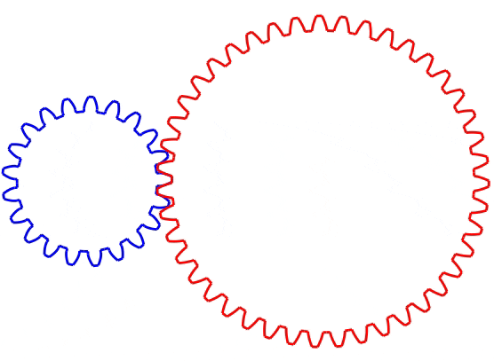

A simple GUI gear designer.  Export your designs as DXFs.  Written in python and GUI-fied with Qt.

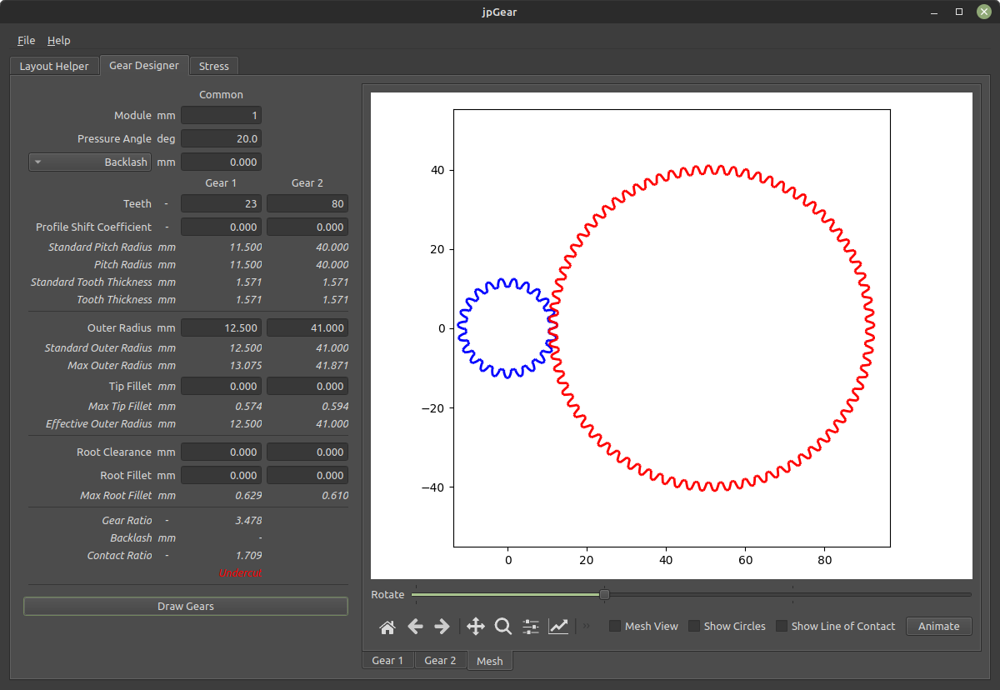

## Installation

### Run the python script directly
If you have python installed, you can run the jpGearQt script directly.
`pip install -r source/requirements.txt`
`python3 source/jpgearqt.py`

### Stand-alone program
jpGearQt has been compiled into a stand-alone program for a couple platforms using [nuitka](https://nuitka.net/).  Go to the `dist/` folder and find your platform.

If you have python installed but would prefer a stand-alone version, you can create your own using nuitka.  The nuitka options are already in the source file, so you just need to run
`pip install nuitka`
`pip install -r source/requirements.txt`
`python3 -m nuitka source/jpgearqt.py`

## How to Use

### Layout Helper
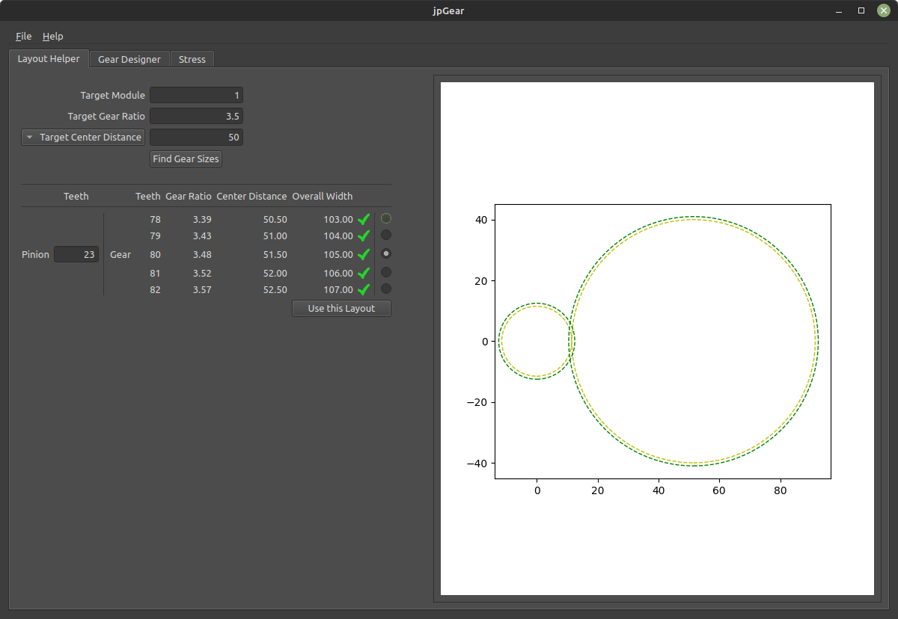

The Layout Helper tab helps you get a basic layout.  This tab is optional - if you already have an idea of the design you want, you can skip ahead directly to the Gear Designer tab.  For the Layout Helper, you'll need a target module, a target gear ratio, and either a target center distance or a target overall width.

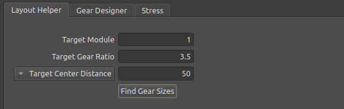

jpGear will suggest some gear tooth combinations.  It's good practice to have the numbers of gear teeth be coprime, which jpGear highlights with the green check mark.  You can change the number of teeth on the pinion to see new options.  When you are happy with the basic layout, click the 'Use this Layout' button to move to the Gear Designer tab.

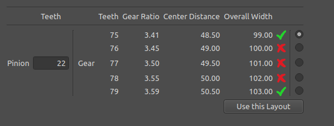

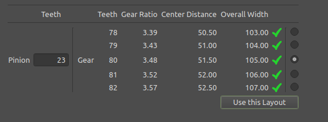

### Gear Designer
The Gear Designer tab gives you more options to fine-tune your design.  If you used the Layout Helper tab, some of the design parameters will already be filled in.
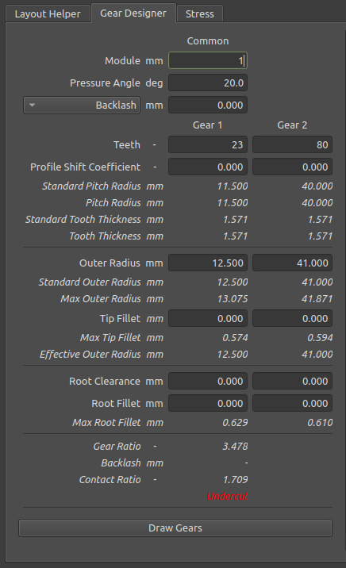

jpGear will provide certain standard and maximum dimensions for reference.  See the glossary for more info on each design parameter.  **Hint - press Ctrl-D to redraw the gears.**
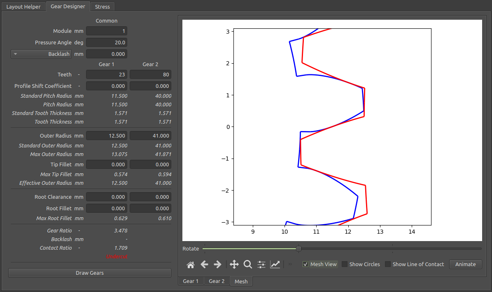
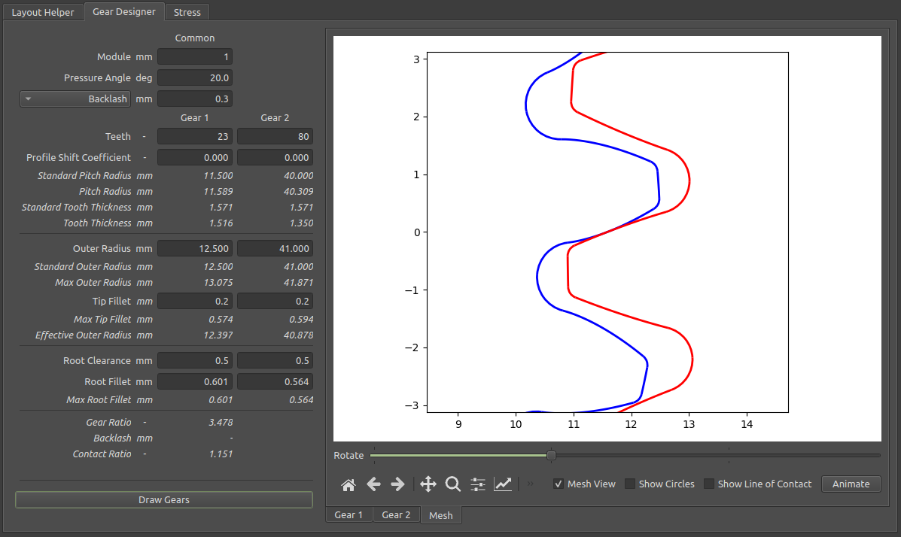
When you are happy with your design, you can either move to the Stress tab or export the gear designs.

### Stress Calculator

### Export Design
When you are happy with your design, go to File->Export DXF to create CAD drawings.
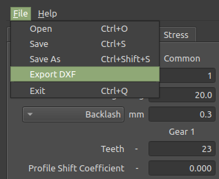

### Glossary of Gear Terms
Gear design is a complex subject, and this glossary is by no means complete.  It's meant as a cheat sheet for those with a basic understanding of how gears work.
---
#### Module
The module sets the overall scale of the gear.  So for example, doubling the module will double the size of the gear.  **Two mating gears must have the same module.**  In theory, the module can be anything you like.  But practically speaking, manufacturers stick to certain common sizes.  Here's a partial list of common sizes:

- 0.5
- 0.6
- 0.7
- 0.8
- 0.9
- 1
- 1.25
- 1.5
- 2
- 2.5
- 3
- 4
- 5
- 6
- 8
- 10
---
#### Pressure Angle
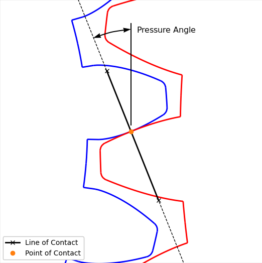
When the teeth of one gear press against the teeth of a mating gear, the transmitted force acts at an angle relative to the two gears.  This angle is called the *pressure angle*.  In theory, this can be any angle you want, but 20° is currently the standard.  Note that in the past 14.5° was a popular pressure angle.
---
#### Backlash
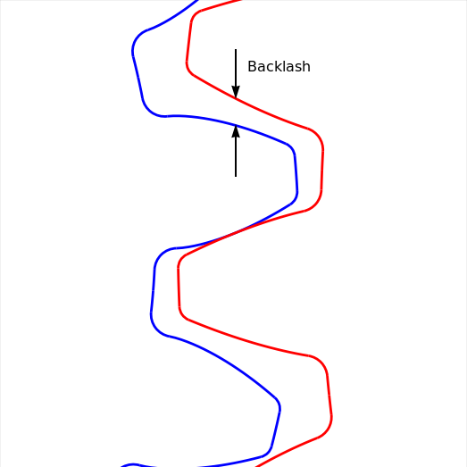
Backlash is the clearance on the backside of the gear teeth.  Some backlash in needed to prevent the gears from binding together.  Increasing backlash reduces tooth thickness and worsens contact ratio.
---
#### Profile Shift Coefficient

#### Outer Radius

#### Tip Fillet

#### Root Clearance

#### Root Fillet