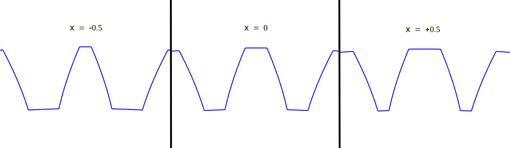
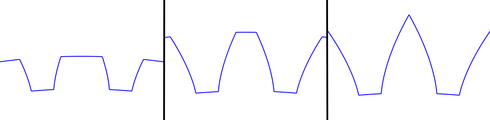
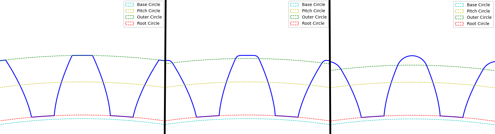
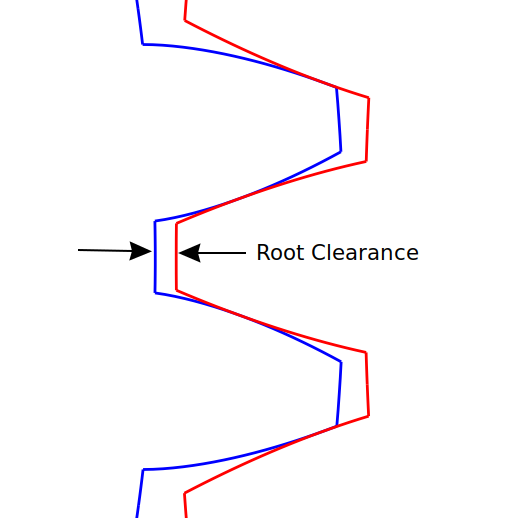
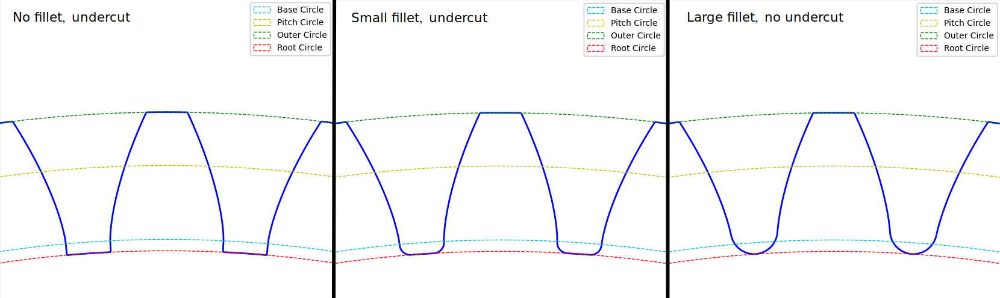

# jpGearQt

A simple GUI gear designer.  Export your designs as DXFs.

Written in python and GUI-fied with Qt.


## Installation

### Stand-alone program
jpGearQt has been compiled into a stand-alone program for a couple platforms using [nuitka](https://nuitka.net/).  Go to the `dist/` folder and find your platform.  Download and run the executable, no installation required.

### Run the python script directly
If you have python installed, you can also run the jpGearQt script directly.
```
pip install -r source/requirements.txt
python3 source/jpgearqt.py
```

If you have python installed but would prefer a stand-alone version, you can create your own using nuitka.  The nuitka options are already in the source file, so you just need to run:
```
pip install nuitka
pip install -r source/requirements.txt
python3 -m nuitka source/jpgearqt.py
```

## How to Use

### Layout Helper


The Layout Helper tab helps you get a basic layout.  This tab is optional - if you already have an idea of the design you want, you can skip ahead directly to the Gear Designer tab.  For the Layout Helper, you'll need a target module, a target gear ratio, and either a target center distance or a target overall width.


jpGear will suggest some gear tooth combinations.  It's good practice to have the numbers of gear teeth be coprime, which jpGear highlights with the green check mark.  You can change the number of teeth on the pinion to see new options.  When you are happy with the basic layout, click the 'Use this Layout' button to move to the Gear Designer tab.


### Gear Designer


The Gear Designer tab gives you more options to fine-tune your design.  If you used the Layout Helper tab, some of the design parameters will already be filled in.


jpGear will provide certain standard and maximum dimensions for reference.  See the glossary for more info on each design parameter.

**Hint - press Ctrl-D to redraw the gears.**

When you are happy with your design, you can either move to the Stress tab or export the gear designs.

### Stress Calculator

jpGear uses the Lewis method to calculate the tooth bending stress.  Instead of using a look-up table, jpGear finds the inscribed parabola and calculates the stresses directly from it.  Note that jpGear does not consider any additional AGMA stress factors such as the overload factor *Ko* or the dynamic factor *Kv*.

### Export Design


When you are happy with your design, go to File->Export DXF to create CAD drawings.

## Glossary of Gear Terms

Gear design is a complex subject, and this glossary is by no means complete.  It's meant as a cheat sheet for those with a basic understanding of how gears work.

---

#### Module

The module sets the overall scale of the gear.  So for example, doubling the module will double the size of the gear.  **Two mating gears must have the same module.**  In theory, the module can be anything you like.  But practically speaking, manufacturers stick to certain common sizes.  Here's a partial list of common sizes:

- 0.5
- 0.6
- 0.7
- 0.8
- 0.9
- 1
- 1.25
- 1.5
- 2
- 2.5
- 3
- 4
- 5
- 6
- 8
- 10

---

#### Pressure Angle


When the teeth of one gear press against the teeth of a mating gear, the transmitted force acts at an angle relative to the two gears.  This angle is called the *pressure angle*.  In theory, this can be any angle you want, but 20° is currently the standard.  Note that in the past 14.5° was a popular pressure angle.

---

#### Backlash


Backlash is the clearance on the backside of the gear teeth.  Some backlash in needed to prevent the gears from binding together.  Typically, backlash falls in the range 0.03\*module < b < 0.12\*module.

Increasing backlash reduces tooth thickness and worsens contact ratio.

---

#### Profile Shift Coefficient



Profile shift is used to modify the tooth thickness.  A positive coefficient increases tooth thickness, while a negative coefficient reduces tooth thickness.  It is sometimes called 'addendum modification', but this is a misnomer - the tooth thickness can be adjusted indepently of the addendum size.  Note that this is a unitless *coefficient*; the actual change in thickness is a product of the coefficient and the module.  The profile shift coefficient is typically in the range -0.5 < x < 0.5.

Increasing tooth thickness makes the teeth stronger, but makes the contact ratio worse.  Increasing tooth thickness can also help eliminate undercut, especially in gears with very few teeth.  A common tactic is to use a positive profile shift on the pinion to increase strengh, and a negative profile shift on the mating gear to improve the contact ratio.

---

#### Outer Radius



The radius of the the tips of the gear teeth.  jpGear doesn't use addendum and dedendum values, instead letting you control the radii directly.  The *Standard Outer Radius* shows you the radius for an addendum of 1\*module for reference.  The *Max Outer Radius* is the radius at which the teeth come to a sharp point.  Note that the *Max Outer Radius* changes with tooth thickness, i.e. profile shift.

Increasing the outer radius improves the contact ratio, but can cause higher stresses.

---

#### Tip Fillet



The fillet between the tip and sides of the gear teeth.  It isn't always possible (or desirable) to manufacture gears with a sharp corner at the tooth tips.  By including this radius in the design, jpGear can more accurately model the gear performance.

Increasing the tip fillet makes the contact ratio worse.

---

#### Root Clearance



The clearance between the root of one gear and the tip of its mating gear.  jpGear doesn't use addendum and dedendum values, instead letting you control the radii directly.  The *Standard Root Radius* shows you the radius for a dedendum of 1.25\*module for reference.  Note that the *Standard Root Radius* changes with tooth thickness, i.e. profile shift.

Some amount of root clearance is necessary to prevent the gears from binding.  Increasing the root clearance increases stress, and can lead to undercutting.

---

#### Root Fillet



The fillet at the base of the gear tooth.  Note that jpGear takes the root fillet into account when determining if a gear is undercut.  The usual definition for an undercut gear is when the root radius lies below the base circle.  However, a large enough root fillet can add enough material that the tooth thickness does not decrease below the base circle.  jpGear only considers a gear undercut if the point where the root fillet meets the tooth involute lies below the base circle.

Increasing the root fillet increases strength.  In general, the root fillet should be as large as possible.  Just check for any interference with the tip of the mating gear.

## Further Reading

Most of the math for jpGear came from *"The Geometry of Involute Gears"* by J.R. Colbourne.
